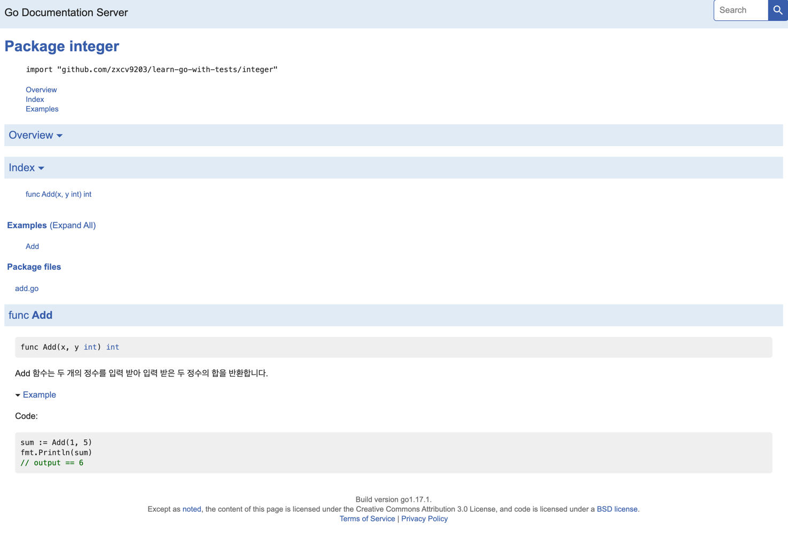

# 정수

두 정수를 더하는 Add라는 함수를 작성하려고 합니다.

먼저, 이 함수를 작성하기 이전에 add_test.go 라는 테스트 파일을 만든 후 Add 함수를 작성해 보겠습니다.

주의 : Go 소스파일을 작성할때 각 폴더에 하나의 package 만을 가질 수 있습니다.

> 테스트 작성하기
```go
package integer

import "testing"

func TestAdder(t *testing.T) {
	sum := Add(2, 2)
	expected := 4

	if sum != expected {
		t.Errorf("expected '%d' but got '%d'", expected, sum)
	}
}
```
Add함수를 호출 한 값과 호출이 이뤄졌을 때 목표로 하는 반환 값이 같은지 테스트 하는 테스트 파일을 위와 같이 만들었습니다.

> 테스트 실행해보기

`go test` 명령어를 사용하여 테스트를 실행해봅시다.

``` 
TIP : `go test` 만 입력시 *_test.go 만 실행됩니다.
한가지 파일만 실행하고 싶은 경우 인자로 파일을 지정하면 됩니다.
```

실행해보면 다음과 같은 컴파일 에러가 발생합니다.

`./add_test.go:6:9: undefined: Add`

왜냐하면 아직 Add 함수가 만들어지지 않아서 테스트파일에서 Add 호출하지 못하기 때문입니다.

이제 직접 Add 파일을 만들어봅시다.

> 테스트를 실행할 최소한의 코드를 작성하고 실패한 테스트를 출력을 확인해보기

컴파일러를 만족시킬 수 있는 최소한의 코드를 작성해봅시다.

```go
package integer

func Add(x, y int) int {
	return 0
}
```

Add 함수가 존재하기 때문에 컴파일 에러는 발생하지 않지만 값이 달라서 FAIL이 발생합니다.

`add_test.go:10: expected '4' but got '0'`

이번에는 코드가 통과할 수 있게끔 작성해봅시다.

> 테스트를 통과할 수 있는 코드를 작성하기

테스트 주도 개발에서 테스트를 통과하기 위한 최소한의 코드를 작성하는 것이 좋습니다.

하지만 테스트 파일을 보고 다음과 같이 함수를 작성해도 통과가 가능할 것입니다.

```go
func Add(x, y int) int {
	return 4
}
```

이런 상황을 막기 위해 하나하나 테스트를 작성할 수도 있겠지만 이런식으로 테스트를 늘리다보면 너무 개발자를 지치게 할 것입니다.

이런 경우를 방지하기 위해서 추후에 속성 기반 테스팅이라는 기술을 소개하겠습니다.

이제 코드를 제대로 고쳐보겠습니다.

```go
func Add(x, y int) int {
	return x + y
}
```

> 리팩토링 하기

현재 코드에서는 실제로 개선할 만한 부분이 많이 없습니다.

대신 이 함수가 어떠한 동작을 하는지 go doc을 이용해서 볼때 알려줄 수 있도록 주석을 작성하는 것이 좋습니다.

다음과 같이 주석을 작성하여 함수가 어떤 역할을 하는지 작성해 봅시다.

```go
package integer

// Add 함수는 두 개의 정수를 입력 받아 입력 받은 두 정수의 합을 반환합니다.
func Add(x, y int) int {
	return x + y
}

```

`go doc Add` 를 터미널에 입력해서 직접 작성한 설명을 확인해봅시다.
```text
package integer // import "."

func Add(x, y int) int
    Add 함수는 두 개의 정수를 입력 받아 입력 받은 두 정수의 합을 반환합니다.
```

### 예시 만들기

해당 함수를 어떻게 사용하는지 예시를 만드는 것도 좋습니다.

간혹 README 파일과 같이 코드 밖에 작성된 문서들은 실제 사용과 다르게 오래되고 부정확할 수 있습니다.

테스트 파일에 예시를 추가하면 코드에서 실제로 수행하는 작업을 확실하게 실행되는지 알 수 있습니다.

테스트 파일에 사용예시를 적어봅시다.

```go
func ExampleAdd() {
	sum := Add(1, 5)
	fmt.Println(sum)
	// output: 6
}
```

godoc 명령어를 이용하여 HTML에 문서로 자신이 작성한 주석들을 확인할 수 있습니다.

위와 같이 Example* 형태로 함수를 작성하면 HTML 문서에서도 사용예시를 확인할 수 있습니다.


